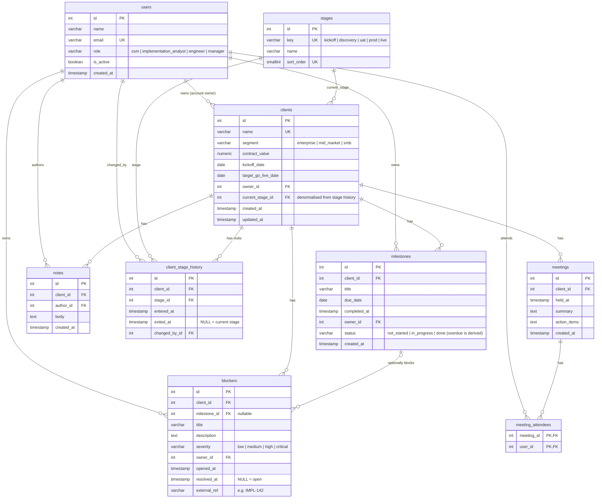

# Entity-Relationship Diagram

Source of truth for the DDL is [`db/schema.sql`](../db/schema.sql).
Design rationale is in [`schema-design.md`](schema-design.md).

## Derived (not stored) attributes

| Attribute                | Derived from                                                     |
|--------------------------|------------------------------------------------------------------|
| `client.health`          | Risk rules over open blockers, milestones, stage age, go-live date |
| `client.days_in_stage`   | `now() - client_stage_history.entered_at` where `exited_at IS NULL` |
| `milestone.is_overdue`   | `status <> 'done' AND due_date < today`                          |
| `blocker.is_open`        | `resolved_at IS NULL`                                            |
| `blocker.age_days`       | `now() - opened_at` (open blockers only)                         |
